# Neo Pilot E2E (End-to-end)

**Thesis Title: Small-Scale Autonomous Car: Design, Implementation, and Remote Monitoring**

**Neo Pilot E2E** is my B.Sc. thesis project in Electrical Engineering. The project focuses on designing, implementing, and testing a small-scale autonomous car with computer vision, end-to-end learning, embedded deployment, and remote monitoring.

The final system was deployed on an **NVIDIA Jetson Nano** and tested on a physical test track.

## Overview

This project studies and implements different approaches for autonomous navigation in a small-scale vehicle. The work was developed around the rules and constraints of small autonomous car competitions such as the FIRA autonomous car league.

The project includes:
- A small-scale autonomous vehicle platform
- Camera-based perception
- Classical computer vision pipelines
- End-to-end neural-network-based steering prediction
- Sensor integration
- Embedded deployment on Jetson Nano
- A remote monitoring and control center
- Test-track design and real-world evaluation

## Thesis Context

This repository is connected to my bachelor thesis:
**Small-Scale Autonomous Car: Design, Implementation, and Remote Monitoring**

The thesis investigates the design of a complete autonomous navigation system, from hardware selection and vehicle assembly to software implementation, perception, control, data collection, model training, deployment, and testing.
The original thesis document is written in Persian, but this README provides an English summary of the project, methods, and implementation.

**Thesis link (in Persian):** https://drive.google.com/file/d/10g1P8eSv3FrCk3JIBJOiu4PbZ1zDiE7U

## System Architecture

The project was developed using two main autonomous navigation paradigms.

### 1. Modular Navigation

The modular approach separates the autonomous driving task into multiple components:
- Image preprocessing
- Lane and line detection
- Road sign and guide sign detection
- Obstacle detection
- Intersection and turn detection
- PID-based steering/control logic
- Simulation and real-world deployment

### 2. End-to-End Learning

The end-to-end approach uses a neural network to predict steering commands directly from camera input.

The pipeline includes:
- Manual driving and data collection
- Image preprocessing
- Dataset preparation
- Neural network model design
- Model training
- Testing on collected data
- Deployment on Jetson Nano
- Real-world test-track evaluation

**Training and Test loss curve:**

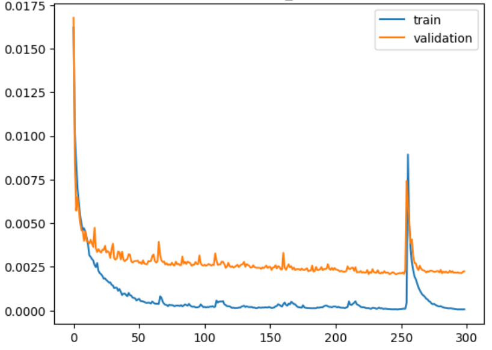

## Hardware

The autonomous car platform used several embedded and sensing components, including:
- NVIDIA Jetson Nano as the main processing board.

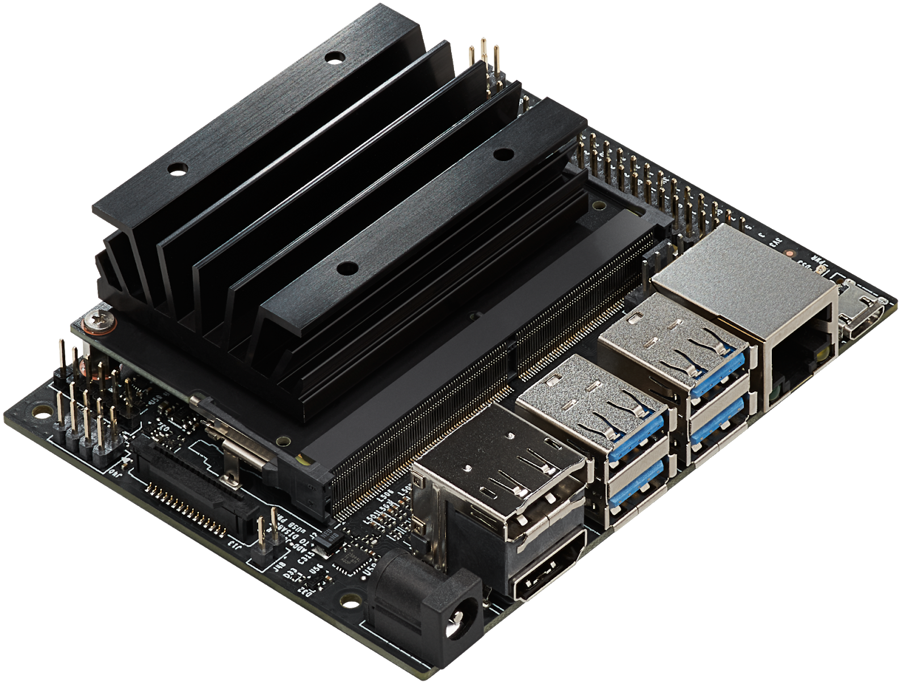

- Camera module for visual perception

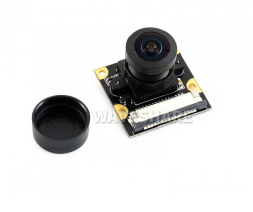

- Ultrasonic sensor for obstacle sensing

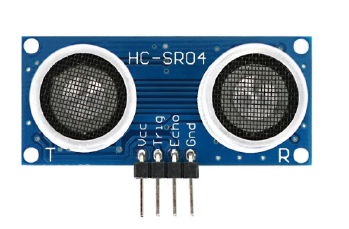

- GPS module

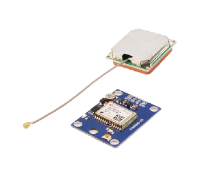
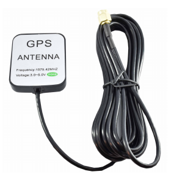

- Arduino Uno for low-level control

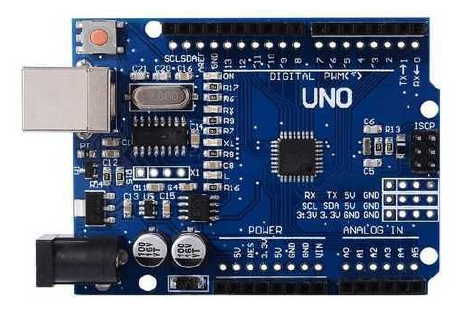

- DC motors with gearbox

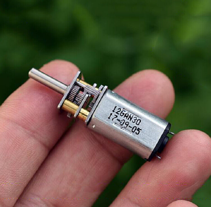

- Servo motor for steering

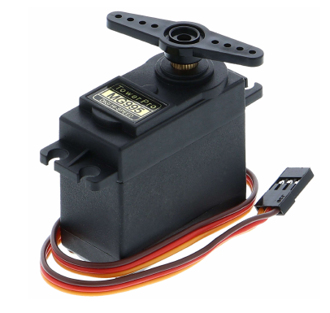

- Motor driver

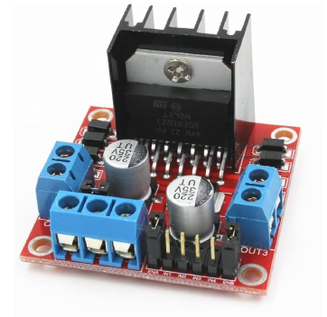

- Power bank and Li-ion battery system

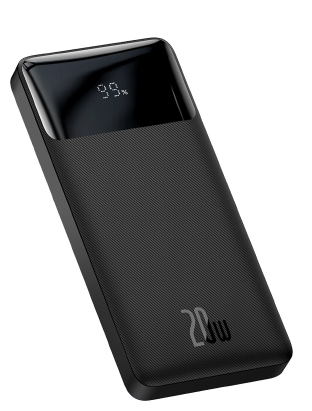
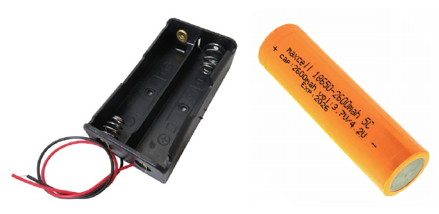

- Custom small-scale vehicle chassis

## Software

The software stack included:
- Python
- OpenCV
- PyTorch
- SQLite
- Flask
- WebSocket communication
- HTML, CSS, and JavaScript for the monitoring interface
- Embedded Linux deployment on Jetson Nano

## Computer Vision and AI Components

The project includes several perception and learning components:

- Image grayscale conversion

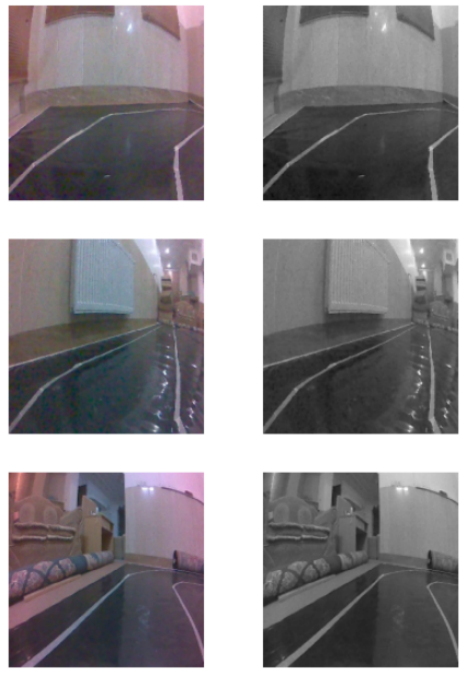

- Cropping and region-of-interest selection

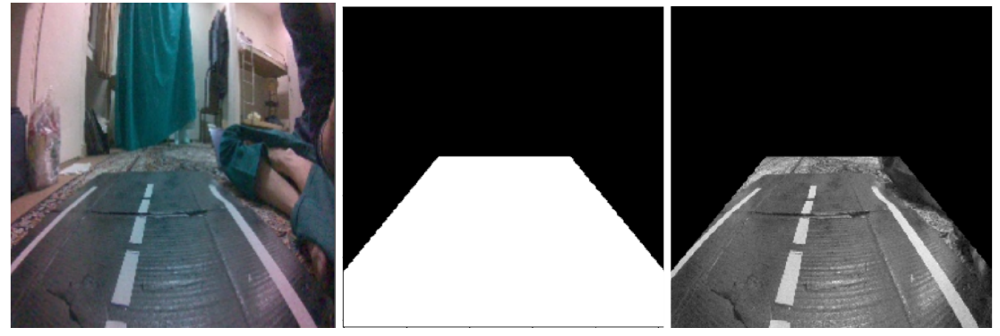

- CLAHE preprocessing

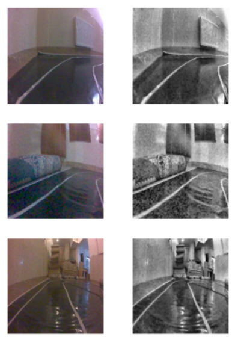

- Thresholding

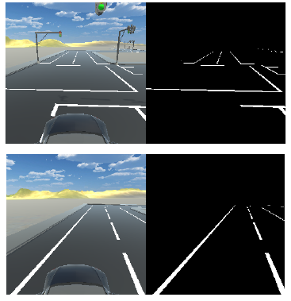

- Canny Edge detection

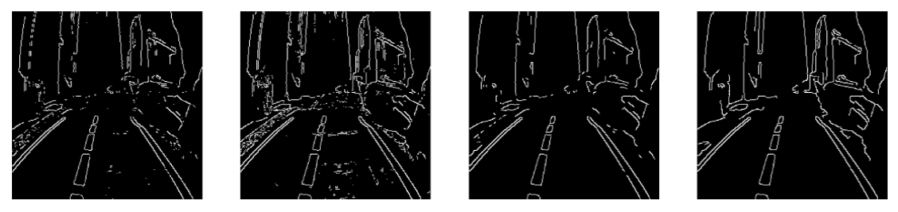

- Contour detection
- Gaussian filter

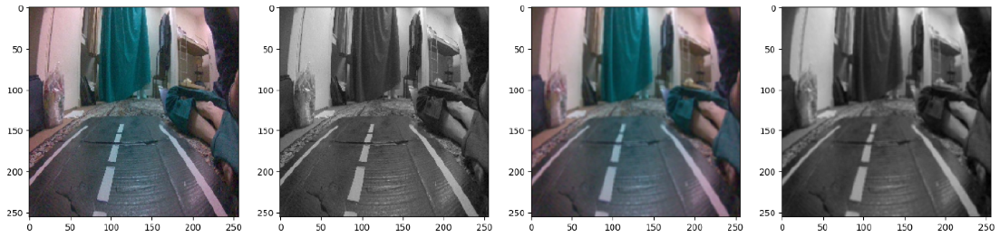

- Lane and line detection

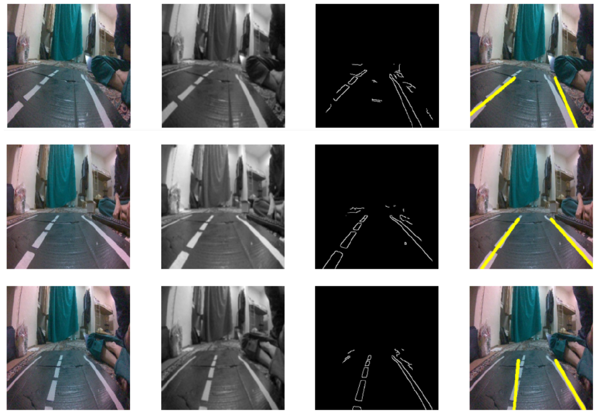

- Road sign detection

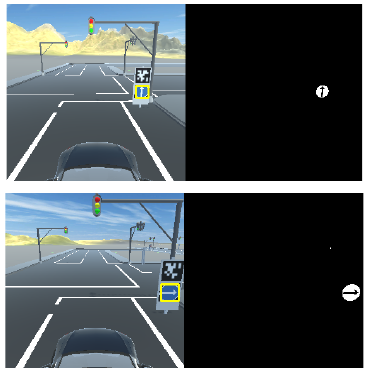

- End-to-end neural network training

- Steering angle prediction
- Real-time inference on embedded hardware

### Full image processing pipeline

**Diagram:**

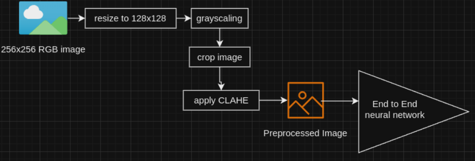

**Output examples:**

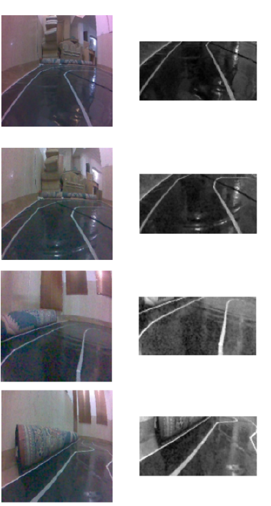

## Remote Monitoring and Control Center

A web-based command center was developed to monitor the vehicle during operation.

**Website:**

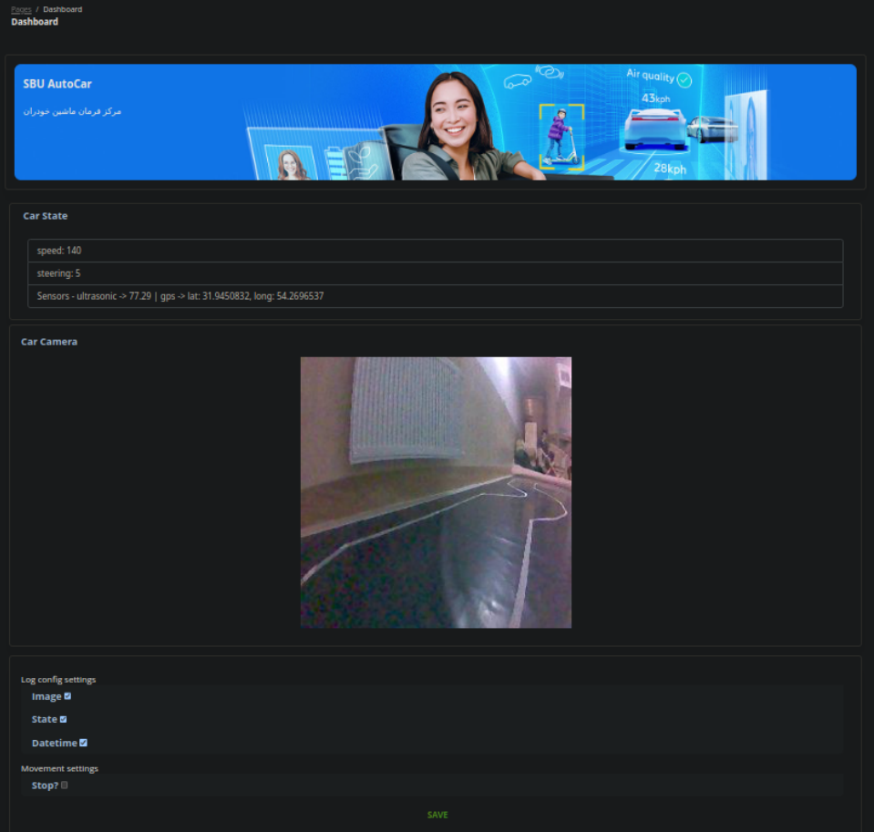

 

**The monitoring system included:**

- Data collection and storage
- Client-server communication
- WebSocket-based real-time updates
- Backend and frontend implementation
- Remote access to vehicle status and collected information

## Deployment

The trained and implemented navigation system was deployed on the Jetson Nano and tested on a designed physical test track.

**A pictures of the test track:**

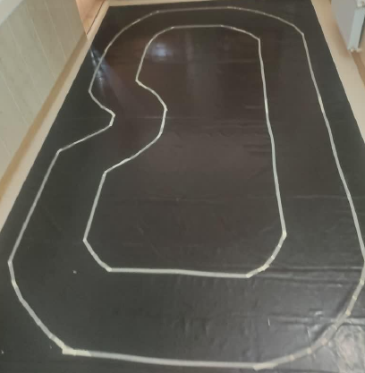

The deployment process included:

- Installing and configuring the Jetson Nano environment
- Connecting the camera and sensors
- Running perception and control software on embedded hardware
- Integrating the vehicle hardware and software
- Testing autonomous driving behavior on the track

**Some inference examples:**

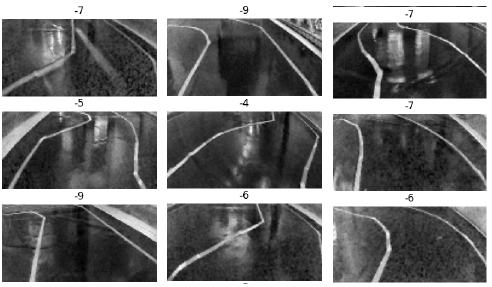

## Other Visuals

### Vehicle Prototype

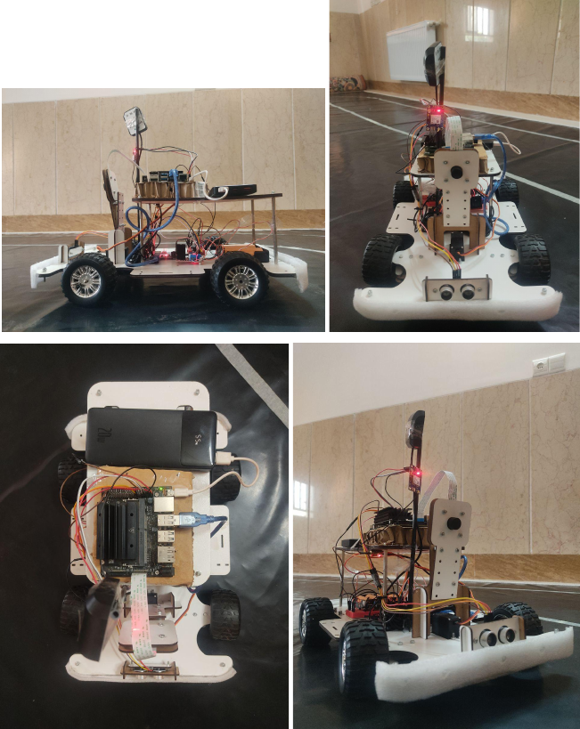

### Demo, Test on the test track:

## Project Status

The project successfully implemented a complete small-scale autonomous vehicle prototype, including perception, control, embedded deployment, and remote monitoring. The system was tested on a physical track with reduced human intervention.

## Keywords

Autonomous driving, small-scale autonomous car, computer vision, deep learning, end-to-end learning, steering prediction, Jetson Nano, embedded AI, robotics, remote monitoring, PyTorch, OpenCV.

## References

1. Hussain, R., & Zeadally, S. (2018). Autonomous cars: Research results, issues, and future challenges. *IEEE Communications Surveys & Tutorials*, 21(2), 1275-1313.
2. "The 6 Levels of Vehicle Autonomy Explained". Synopsys Automotive. Accessed: 12-Feb-2024.
3. "Self-Driving Cars". Prof. Dr. Andreas Geiger, University of Tuebingen. Accessed: 10-Sept-2023.
4. "Image Masking with OpenCV". pyimagesearch.com. Accessed: 11-Feb-2024.
5. "Thresholding-Based Image Segmentation". geeksforgeeks.org. Accessed: 11-Feb-2024.
6. "Hough Transform". The University of Edinburgh. Accessed: 11-Feb-2024.
7. "Traffic Sign Classification with Keras and Deep Learning". pyimagesearch.com. Accessed: 26-June-2024.
8. Pizer, S. M., Amburn, E. P., Austin, J. D., Cromartie, R., Geselowitz, A., Greer, T., et al. (1987). Adaptive histogram equalization and its variations. *Computer Vision, Graphics, and Image Processing*, 39(3), 355-368.
9. "Contrast Limited Adaptive Histogram Equalization". mathworks.com. Accessed: 26-June-2024.
10. Krizhevsky, A., Sutskever, I., & Hinton, G. E. (2012). ImageNet classification with deep convolutional neural networks. *Advances in Neural Information Processing Systems*, 25.
11. Bojarski, M., Del Testa, D., Dworakowski, D., Firner, B., Flepp, B., Goyal, P., et al. (2016). End to end learning for self-driving cars. *arXiv preprint arXiv:1604.07316*.
12. "Singleton pattern". Wikipedia. Accessed: 16-Feb-2024.
13. "Jetson Nano GPIO". jetsonhacks.com. Accessed: 27-June-2024.
14. "JETSON NANO + RASPBERRY PI CAMERA". YouTube. Accessed: 18-Feb-2024.
15. "A Beginner's Guide To Using gpsd (GPS Devices) In Linux". kickstartembedded.com. Accessed: 18-Feb-2024.
16. "NoMachine - Jetson Remote Desktop". jetsonhacks.com. Accessed: 28-June-2024.